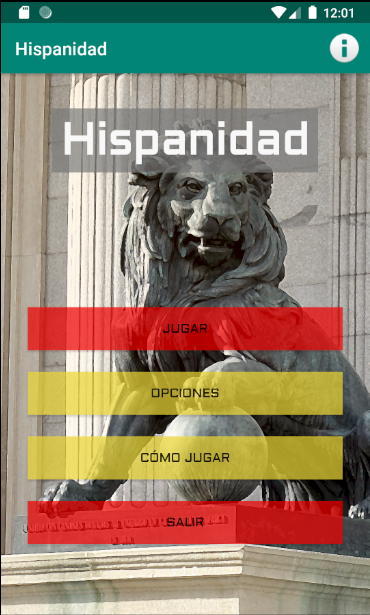
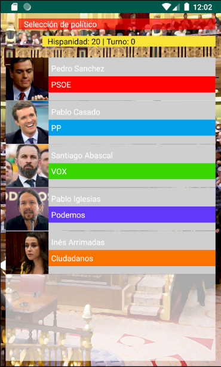
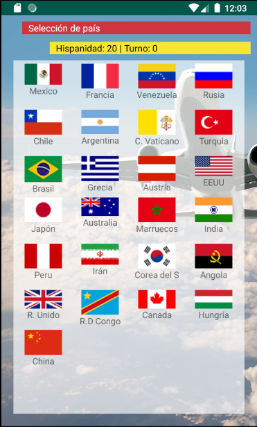
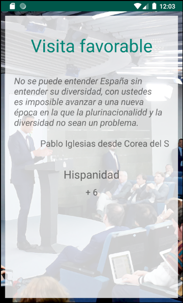
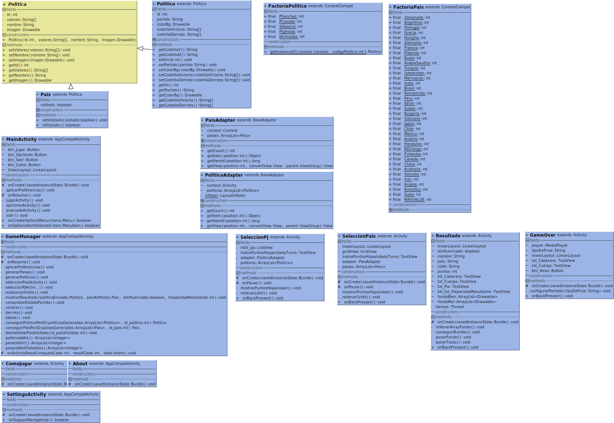

# Hispanidad - Juego android

## Introducción
Práctica para la asignatura de programación multimedia de 2ºDAM del IES Pere Maria Orts & Bosch de Benidorm. 

## Cómo jugar
El jugador empieza eligiendo a un político y enviándolo al país que se quiere influenciar, como resultado de la afinidad de los valores compartidos de ese político con los valores históricos del país visitado, el índice de Hispanidad aumentará o bajará; cada político puede realizar varias visitas diplomáticas, pero los países solo reciben a uno de ellos.  La victoria se logra al conseguir 100 puntos de Hispanidad, si se llega a la visita diplomática número 15 teniendo más de 20 puntos, la partida acabará en tablas, el resto de escenarios posibles desembocan en derrota. 

## Imágenes

    

    
    

    
        

    

## Clases
Diagrama UML de la aplicación.

    

